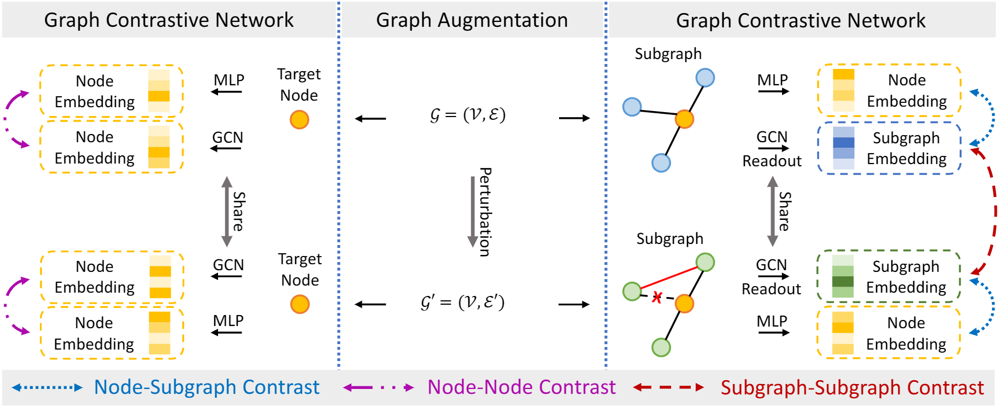

[stars-img]: https://img.shields.io/github/stars/FelixDJC/GRADATE?color=yellow
[stars-url]: https://github.com/FelixDJC/GRADATE/stargazers
[fork-img]: https://img.shields.io/github/forks/FelixDJC/GRADATE?color=lightblue&label=fork
[fork-url]: https://github.com/FelixDJC/GRADATE/network/members
[visitors-img]: https://visitor-badge.glitch.me/badge?page_id=FelixDJC.GRADATE
[adgc-url]: https://github.com/FelixDJC/GRADATE

# Graph Anomaly Detection via Multi-Scale Contrastive Learning Networks with Augmented View

<p align="center">   
    <a href="https://pytorch.org/" alt="PyTorch">
      </a>
    <a href="https://aaai.org/Conferences/AAAI-23/" alt="Conference">
        </a>
<p/>


[![GitHub stars][stars-img]][stars-url]
[![GitHub forks][fork-img]][fork-url]
[![visitors][visitors-img]][adgc-url]


An official source code for paper "Graph Anomaly Detection via Multi-Scale Contrastive Learning Networks with Augmented View", accepted by AAAI 2023. Any communications or issues are welcomed. Please contact jingcan_duan@163.com. If you find this repository useful to your research or work, it is really appreciate to star this repository. :heart:

-------------

### Overview

<p align = "justify"> 
Graph anomaly detection (GAD) is a vital task in graph-based machine learning and has been widely applied in many real-world applications. The primary goal of GAD is to capture anomalous nodes from graph datasets, which evidently deviate from the majority of nodes. Recent methods have paid attention to various scales of contrastive strategies for GAD, i.e., node-subgraph and node-node contrasts. However, they neglect the subgraph-subgraph comparison information which the normal and abnormal subgraph pairs behave differently in terms of embeddings and structures in GAD, resulting in sub-optimal task performance. In this paper, we fulfill the above idea in the proposed multi-view multi-scale contrastive learning framework with subgraph-subgraph contrast for the first practice. To be specific, we regard the original input graph as the first view and generate the second view by graph augmentation with edge modifications. With the guidance of maximizing the similarity of the subgraph pairs, the proposed subgraph-subgraph contrast contributes to more robust subgraph embeddings despite of the structure variation. Moreover, the introduced subgraph-subgraph contrast cooperates well with the widely-adopted node-subgraph and node-node contrastive counterparts for mutual GAD performance promotions. Besides, we also conduct sufficient experiments to investigate the impact of different graph augmentation approaches on detection performance. The comprehensive experimental results well demonstrate the superiority of our method compared with the state-of-the-art approaches and the effectiveness of the multi-view subgraph pair contrastive strategy for the GAD task.


<div  align="center">    
    
</div>

<div  align="center">    
    Figure 1: Overall framework of GRADATE.
</div>


### Requirements

The proposed GRADATE is implemented with python 3.7 on a NVIDIA 3070 GPU. 

Python package information is summarized in **requirements.txt**:

- torch==1.10.2
- dgl==0.4.1
- numpy==1.19.2

### Quick Start

python run.py

### Citation

If you find this project useful for your research, please cite your paper with the following BibTeX entry.

```
@inproceedings{GRADATE,
  title={Graph Anomaly Detection via Multi-Scale Contrastive Learning Networks with Augmented View},
  author={Duan, Jingcan and Wang, Siwei and Zhang, Pei and Zhu, En and Hu, Jingtao and Jin, Hu and Liu, Yue and Dong, Zhibin},
  booktitle={Proc. of AAAI},
  year={2023}
}
```